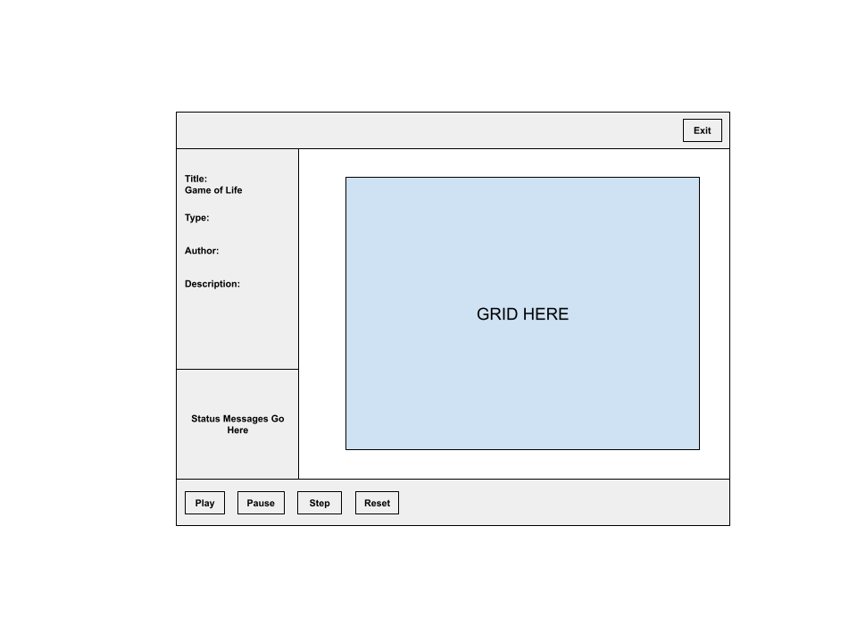
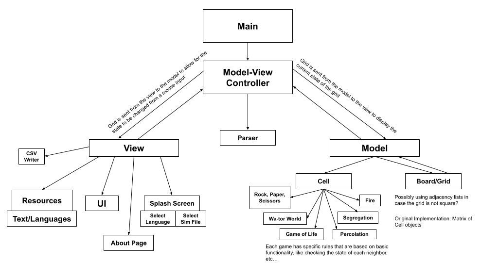

# Cell Society Design Plan
### Team 3
### Nick Ward, Jake Vigeant, Vaishvi Patel, Luyao Wang, and Eka Ebong

## Design Overview
 * Cell Class:
   * For the cells, there should be one master Cell class that can return parameters about it such as its state, ID/position, and setting/changing the future state of the cell. 
   * The subclasses of Cell will override the setFutureState method by taking in a list of neighbors, setting the future state to a new integer based on those neighbors.

 * Grid Class:

 * UI/view:

 * Controller: 
   * The controller is responsible for creating the calling the parser classes and extracting useful information about the initial state of the grid and the metadata about the simulation including its type and game parameters. It creates the appropriate model and view classes giving them only the information they need.
   * On every step of the simulation, the controller asks the model for the next updated version of the grid. It translates the model's grid states to a format the view understands using the getViewGrid() function.

#### Overall design goals
The overall design goals for the project are not only to implement the skills we learned last project, including abstraction and testing, but also spending a lot of time focusing on the design of the project at the beginning. Our design should not just work for the requirements given to us, but should follow the Open-Closed Principal to allow for new features without major changes to our base code, have separation of view and model with a proper View-Model controller.

#### Classes, their behavior and relationships (**not** instance variables)

| Cell                                                       |              |
|------------------------------------------------------------|--------------|
| int getCurrentState()                                      | currentState |
| int getFutureState()                                       | futureState  |
| void setFutureStateValue(int futureState)                  | futureState  |
| void setFutureState(List<Cell> neighbors)                  | neighbors    |
| void setId(int id)                                         | id           |
| int getId()                                                | id           |
| void List<Integer> getNeighborStates(List<Cell> neighbors) | neighbors    |

| GameOfLifeCell                       | extends Cell |
|--------------------------------------|--------------|
| setFutureState(List<Cell> neighbors) | neighbors    |

| CellSocietyController                                    |       |
|----------------------------------------------------------|-------|
| getSimData()                                             | Model |
| loadSimulation(Stage stage)                              | View  |
| getViewGrid() - translates backend grid to frontend grid |       |
| setBackEndCellsbyID(Map<Integer, Cell> backEndCellsbyID) |       |

| Parser                                                 |     |
|--------------------------------------------------------|-----|
| parseData(File simFile) throws FileNotFoundException() |     |

| SimParser                                              | extends Parser |
|--------------------------------------------------------|----------------|
| parseData(File simFile) throws FileNotFoundException   |                |

| CSVParser                                                        | extends Parser |
|------------------------------------------------------------------|----------------|
| parseData(File input) throws IOException, CsvValidationException |                |
| parseFirstLine() throws CsvValidationException, IOException      |                |

## Design Details

#### Use Cases

#### Extension Cases

 * What commonalities will be factored out into superclasses? 
   * The cell class is a great example of having a few common methods, and the subclasses are the cells for each type of game with different rules being contained in those cells. Those cells can also override those main methods too if needed and can hold different types of data based on the cell type.
 
 * How will differences be handled when superclasses are extended? 
   * New methods would be added if necessary, but public methods such as changing the state, will be overriden based on the different cell type and rules for each corresponding simulation.

## Design Considerations

Justification for classes and methods given in the design.

#### Design Issue #1
One of the biggest points of contention of our design was how we would represent the locations of the cells in the grid.

 * Design #1 Tradeoffs
   * Description 
     * The locations of each cell could be represented as a row and a column (corresponding to the x and y coordinates of the cell).

   * Pros 
     * The row and column approach would be easy to implement and would allow for easy translation from the view to the model, as the location of each cell could be easily determined.

   * Cons 
     * Rows and columns would make it difficult for the grid to be non-rectangular. 
     * This would require more memory and parameters to keep track of, as each cell would need to store two integers, one for the row and one for the column.

 * Design #2 Tradeoffs
   * Description 
     * The other way would be to use a cell ID, and then have a map that maps the ID to the row and column (in the current case of a rectangular visual representation).

   * Pros 
     * The ID approach would allow for non-rectangular grids, as numbers could be mapped to any position and relation to each other.

   * Cons 
     * The ID approach would make it difficult to implement the front-end and visual representation.

 * Justification for choice 
   * In the end, even though it would be more difficult to initially implement, the ID approach is the best way to add more representations and makes our design more open to new changes, even if it isn't completely necessary for this upcoming deadline.

#### Design Issue #2
Another design issue we faced was how we were going to have the view and model access the grid itself.

 * Design #1 Tradeoffs
   * Description 
     * The first idea we had was to just pass the data structure from the view to the model.

   * Pros 
     * It would be easy to have both the view and the model modify grid, and makes intuitive sense.

   * Cons 
     * However, this would contradict the ideas we discussed in class about how the code reveals too much information about the structure of our design and would be very co-dependent on each other.

 * Design #2 Tradeoffs
   * Description 
     * Another idea was to have two different representations of the grid in the model and the view, and the controller would pass only necessary information to each side.
   
   * Pros 
     * This would make it so that the grid can be represented in any way on the back-end and front-end, and is flexible to change as long as we create a wrapper around each data structure that can access and change the data in the same way.

   * Cons 
     * It would be more work on the controller, and require many more methods.
     * It will be important to have both the model and view agree on the current state of the grid, and to have safeguards to prevent that.
 
 * Justification for choice 
   * In the end, we decided on the two separate representations, which will allow for more easy changes in the future due to our flexible design decisions.

#### Data Structure Implementation Change

 * Implementation #1
   * Description
   
   * Classes possibly affected
 
   * Methods possibly affected

 * Implementation #2
   * Description
   
   * Classes possibly affected
 
   * Methods possibly affected
 
 * Justification for how implementation choices is hidden
 

#### File Format Implementation Change

 * Implementation #1
   * Description: simulation file separates key values by a colon instead of an equal sign
   
   * Classes possibly affected: SimParser
 
   * Methods possibly affected: parseData()

 * Implementation #2
   * Description: simulation file has more parameters than just required ones
   
   * Classes possibly affected: none
 
   * Methods possibly affected: none
 
 * Justification for how implementation choices is hidden
   * The exact format of the simulation file does not matter. There is only one method doing the parsing of a simulation file. It splits the simulation file into key value pairs and adds them to a hashmap. It doesn't care for what the keys or the values are. There also exists a parent Parser class that is extended to form the CSVParser and the SimParser. If there is any other file format that needs parsing, the Parser class can be extended to add more functions as necessary for that specific file type. 

#### JavaFX "Grid" Component Implementation Change

 * Implementation #1
   * Description
   
   * Classes possibly affected
 
   * Methods possibly affected

 * Implementation #2
   * Description
   
   * Classes possibly affected
 
   * Methods possibly affected
 
 * Justification for how implementation choices is hidden

## User Interface

Here is our amazing UI:

## Team Responsibilities

#### Primary Responsibilities
 * Nick Ward: Cell class and subclass creation

 * Jake Vigeant

 * Vaishvi Patel: Create the controller class which connects the backend and frontend

 * Luyao Wang

 * Eka Ebong

#### Secondary Responsibilities
 * Nick Ward: UI development/functionality and grid methods

 * Jake Vigeant

 * Vaishvi Patel: UI testing and file parsing

 * Luyao Wang

 * Eka Ebong

#### Schedule Plan
Goal for Week 1:
 * Get the basic functionality to work, focus on good design over functionality (for now)

Goal for Week 2:
 * Refactor current methods and implement most, if not all, of the simulation types

Goal for Week 3:
 * TBD

#### Extras
Here's a early hierarchy diagram:

